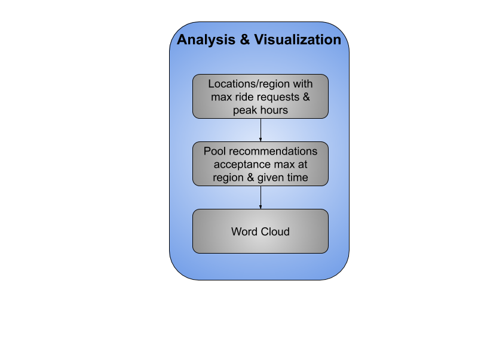

# RAPID-Pool-A-better-way-to-Share-Rides
Uber rides have become a convenient means of transport but irrespective of the increased demand at certain locations and time periods, there are issues such as unavailability of rides, or longer waiting periods for the customer. To resolve this issue, we provide a Data Analytics solution using Apache Spark on live streamed data to locate users heading to the same vicinity and suggest the customer to pool their rides. We use Spark as we are streaming live data and analyzing which locations are likely to face shortage of rides. This will reduce the waiting time and solve the issue of unavailability as well as provide incentives, such as reduced ride costs.

## Problem Statement
With the increase in demand for taxis, many of the users are either unable to find any cabs
around them or have to wait for a long period for the cab to arrive. This causes
inconveniences for the customers and loss for the company. Hence we suggest the customers
to pool their rides and provide incentives such as reduced ride costs or coupons. We use
Spark to find the top 10 regions in a city which has the most traffic requests and suggests the
user to pool their rides if it belongs to the region. With this implementation, we can prioritize
availability of cabs for the customers if there is a high chance of cabs being unavailable at the
moment due to previous records by utilizing Spark GraphX. By using this, we are making a
larger crowd to get rides during rush hours and save from high price surges during the time.

## Spark
Spark is a data processing platform which can run programs almost 100x faster than Hadoop.
It performs large scale parallel and distributed data processing for real time data. To achieve
greater efficiency, Spark uses Resilient Distributed Dataset (RDD), which is a distributed
collection of objects that can be operated in parallel. This RDD object is loaded from a collection and can perform operations such as Transformations and Actions. For our solution,
we are using Filter, Map and Reduce operations to process the required data and utilize this
data to generate graphs for our GraphX.

## Solution
To solve the above problem, we use previous ride requests as our data source and use this to
show which locations have high demand and hence suggests the customers to use ride
sharing and provide incentives such as reduced costs, and coupons. We suggest use Python
as the main language for our solution. The main operations to
perform are given below :
### Data Extraction
1.  We use Uber API to get all historical ride requests from
different regions and different time periods.

2.  GET/partners/trips is used to get all the trips and
GET/requests/current to get the current ride requests
from the customers.

3.  This data is stored as a JSON format where we will
utilize the pickup address , destination address and
timestamp for each trip.

4.  We use this JSON data and convert it to RDD object,
which has the list of all trips and the current trip details
from the customer, is fed as an input to the Spark
framework.
Sample Data :
```
{
  "product_id": "17cb78a7-b672-4d34-a288-a6c6e44d5315",
  "request_id": "a1111c8c-c720-46c3-8534-2fcdd730040d",
  "status": "accepted",
  "surge_multiplier": 1.0,
  "pickup": {
    "alias": "work",
    "latitude": 37.3303463,
    "longitude": -121.8890484,
    "name": "1455 Market St.",
    "address": "1455 Market St, San Francisco, California 94103, US",
    "eta": 5
  },
  "destination": {
    "alias": "home",
    "latitude": 37.6213129,
    "longitude": -122.3789554,
    "name": "685 Market St.",
    "address": "685 Market St, San Francisco, CA 94103, USA",
    "eta": 19
  },
}
{
"trips": [
  {
    "start_city": {
      "latitude": 38.3498,
      "display_name": "Charleston, WV",
      "longitude": -81.6326
    },
    "status_changes": [
      {
        "status": "accepted",
        "timestamp": 1502843899
      },
    ],
    "driver_id": "8LvWuRAq2511gmr8EMkovekFNa2848lyMaQevIto
    "trip_id": "b5613b6a-fe74-4704-a637-50f8d51a8bb1",
    }
  ],
}
```

<p align="center">
  <br><br>
  
  <figcaption><p align="center">Data Preprocessing</p></figcaption>
</p>

## Spark
1.  The input to the Spark is fed as a RDD object which will help us run operations
parallelly and thereby increasing the efficiency.
2.  Transformation : We first filter out the trips based on location, time period and day
of the week. Then we find the streets and zip code which have requests in each of the
locations using a Mapper.
3.  Actions : The streets and zip codes are then feed as an input to the Reducer to give
the total count for each street. This is done by Word Count algorithm. This shows that
these regions have many requests during this time period and hence we can show
that these regions will most likely have less
number of driver to serve the requests.

<p align="center">
  <br><br>
  
  <figcaption><p align="center">Spark</p></figcaption>
</p>

## GraphX
1.  This is a library used to perform parallel, iterative
computations.
2.  We then use these regions to classify whether the
current ride request belongs to any of the Top 10
demanding regions. If so, we pass this request
from the customer to GraphX which will store the
request as one of the nodes in the graph.
3.  A new node is created and the graph is
regenerated using iterative graph computations to
get the live information.
4.  When multiple nodes are created due to multiple
requests from different users, we form edges
between the nodes if they have the same
destination. This shows that these customers can
share rides to the same destination in real time.

<b>Code for Storing Vertices</b>
```
val vertexRDD: RDD[(Long, (String, Int))] = sc.parallelize(vertexArray)
val edgeRDD: RDD[Edge[Int]] = sc.parallelize(edgeArray)
val graph: Graph[(String, Date, String, String), String] = Graph(vertexRDD, edgeRDD)
graph.vertices.filter { case (id1, (user1, time1, src1, dest1)),
case (id2, (user2, time2, src2, dest2)) => time1 – time2 < 5 and src1 == src2 and
dest1 == dest2}
.collect.foreach { case (id, (name, age)) => println(s"$user is going to
$dest from $src at $time))}
```

<b>Code for finding relation between edges through Destination</b>

```
for (triplet <- graph.triplets.collect)
{
println(s"${triplet.srcAttr._1} can share with ${triplet.dstAttr._1}")
}
```

## Visualization :
1.  The output of the Spark will give us the graph relations between customers who will
be able to share rides in high demanding areas.
2.  We then give a notification to the user stating that they can share the ride and save
money in the process as well. The company could also provide some incentives such
as coupons to the customer to increase the number of customers using car pools.
3.  We are visualizing the locations which have a high demand according to the time
period through Tableau by producing a Heat Map.
```
val vertexRDD: RDD[(Long, (String, Int))] = sc.parallelize(vertexArray)
val edgeRDD: RDD[Edge[Int]] = sc.parallelize(edgeArray)
val graph: Graph[(String, Date, String, String), String] = Graph(vertexRDD, edgeRDD)
graph.vertices.filter { case (id1, (user1, time1, src1, dest1)),
case (id2, (user2, time2, src2, dest2)) => time1 – time2 < 5 and src1 == src2 and
dest1 == dest2}
.collect.foreach { case (id, (name, age)) => println(s"$user is going to
$dest from $src at $time))}
Code for finding relation between edges through Destination
for (triplet <- graph.triplets.collect)
{
println(s"${triplet.srcAttr._1} can share with ${triplet.dstAttr._1}")
}
```
<p align="center">
  <br><br>
  
  <figcaption><p align="center">Visualization</p></figcaption>
</p>

## Output Visualizations
In this image, we can see that these regions have more requests during this time. Bailey Ave
has the highest. Hence during this time we are suggesting users to make Pool rides to give
them benefits.

<p align="center">
  <br><br>
  
  <figcaption><p align="center">Heat Map of Regions with Max Ride Requests</p></figcaption>
</p>

This image shows which regions have used the pool sharing that have been benefited by our
pool recommendation.

<p align="center">
  <br><br>
  
  <figcaption><p align="center">Heat Map of Regions Benefited by Pool Recommendation</p></figcaption>
</p>

In this graph, we can see that 3 of the users are heading to Elmwood from Bailey Ave. Hence
there is a connection between these nodes which tells each of these users to share the cab to
go to the destination.

## Summary
1.  In this Lab we are using Apache Spark to make customers use car pools for cabs if there
might be a possibility of shortage of drivers.
2.  This is shown through previous ride trips from the Uber API, where we will segregate the
trips based on locations and timestamp.
3.  The top regions which have the most number of trips are considered as the regions which
will have a high possibility of less drivers in the vicinity.
4.  Hence for those regions and time, we us GraphX to show which users can share their rides
and would be given benefits to the users as well.
5.  This helps the company as well as they are not losing their customers due to lack of
drivers in the vicinity. It provides a new feature through which they can retain their
customers.
Takeaways
6.  By utilizing Spark, we are able to process real time data and put forth the results for
immediate use.
- We learnt about how to utilize Spark’s performance to make real time decisions.
Figure 3 Graph Visualization of Requests for Buffalo Location @ Time Period 5-5:30

7.  This helps us to make more informed decisions on the go.
8.  We are also able to visualize the data processed so that we can use this data understand
when the users request rides particularly and take necessary actions towards that.

## References
1. https://developer.uber.com/docs/riders/references/api/v1.2/requests-request_idget#
path-parameters
2. https://developer.uber.com/docs/drivers/references/api/v1/partners-trips-get
3. https://www.simplilearn.com/spark-algorithm-tutorial
4. https://www.toptal.com/spark/introduction-to-apache-spark
